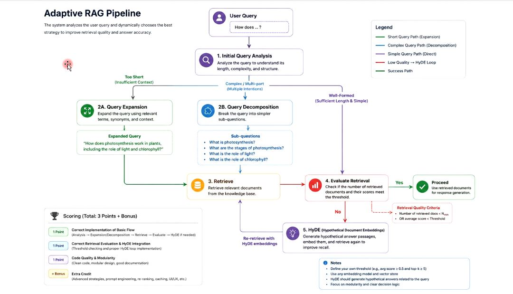
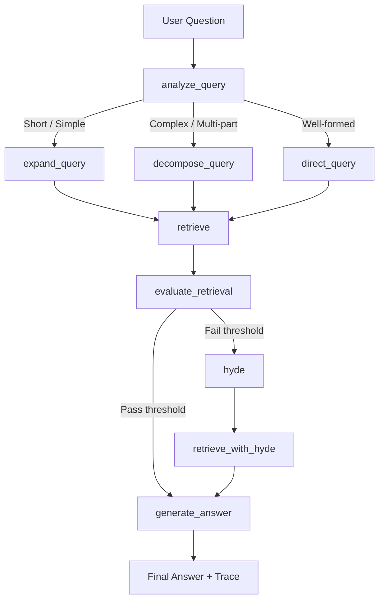

# Adaptive RAG Pipeline with LangChain, LangGraph, and Streamlit

This repository is a course assignment implementation of an **Adaptive Retrieval-Augmented Generation (RAG)** pipeline.

The app receives a user question, analyzes the query, dynamically chooses the best query-enhancement strategy, retrieves relevant chunks from a small knowledge base, evaluates retrieval quality, and falls back to **HyDE (Hypothetical Document Embeddings)** when retrieval quality is below a configurable threshold.

The project is intentionally compact and educational. It focuses on the control flow and adaptive decision logic rather than on building a production-scale vector database.

---

## Reference Architecture from the Assignment

The assignment architecture describes an adaptive RAG pipeline with three main query paths:

1. **Short / simple query path** → Query Expansion
2. **Complex / multi-part query path** → Query Decomposition
3. **Well-formed query path** → Direct Retrieval
4. **Low retrieval quality path** → HyDE fallback and re-retrieval



---

## Implemented Architecture

This implementation follows the same high-level design, but expresses it as a **LangGraph state machine**. Each processing step is a graph node, and routing is handled through conditional edges.



### Graph Nodes

| Node | Purpose |
|---|---|
| `analyze_query` | Classifies the user query as `EXPANSION`, `DECOMPOSITION`, or `DIRECT`. |
| `expand_query` | Uses a LangChain prompt chain to expand short or underspecified queries. |
| `decompose_query` | Uses a LangChain prompt chain to break complex questions into 2-4 sub-questions. |
| `direct_query` | Sends a clear, well-formed question directly to retrieval. |
| `retrieve` | Retrieves top-k chunks from a FAISS vector store. |
| `evaluate_retrieval` | Checks retrieval quality using `num_docs` and `avg_score`. |
| `hyde` | Generates a hypothetical answer-like document when initial retrieval fails. |
| `retrieve_with_hyde` | Re-runs retrieval using the HyDE-generated document. |
| `generate_answer` | Generates the final answer from retrieved context and reports the route used. |

---

## How This Project Uses the Course Notebooks

The course notebooks introduced three query-enhancement techniques. This project turns those notebook ideas into one runnable Streamlit application.

### 1. Query Expansion

From the query expansion notebook, this project uses the same core idea:

```python
query_expansion_prompt | llm | StrOutputParser()
```

Short or underspecified queries are expanded with synonyms, related terms, and useful context before retrieval.

Example:

```text
Original query: LangChain memory
Expanded query: LangChain memory types, conversation history, buffer memory, summary memory, vector memory, context retention
```

### 2. Query Decomposition

From the query decomposition notebook, this project uses the same pattern:

```python
decomposition_prompt | llm | StrOutputParser()
```

Complex questions are decomposed into smaller retrieval questions.

Example:

```text
Original query: How does LangChain use memory and agents compared to CrewAI?

Sub-questions:
1. How does LangChain use memory?
2. How do LangChain agents work?
3. How do CrewAI agents work?
4. What are the key differences between LangChain and CrewAI?
```

### 3. HyDE

From the HyDE notebook, this project uses the same strategy:

```python
hyde_prompt | llm | StrOutputParser()
```

If retrieval quality is below the selected threshold, the system generates a hypothetical document and uses that generated text for a second retrieval attempt.

---

## Features

- Streamlit web UI
- LangChain prompt chains
- LangGraph conditional workflow
- FAISS vector store
- OpenAI-compatible chat model support
- OpenAI-compatible embedding support through a custom `GapGPTEmbeddings` wrapper
- Local hash embedding fallback for offline demos
- Query Expansion path
- Query Decomposition path
- Direct Retrieval path
- Retrieval quality evaluation
- HyDE fallback and re-retrieval
- Full execution trace in the UI
- Retrieved chunk inspection with similarity scores
- Configurable threshold, top-k, chunk size, and chunk overlap

---

## Project Structure

```text
adaptive_rag_langgraph_streamlit/
├── app.py
├── README.md
├── requirements.txt
├── .env.example
├── .gitignore
├── adaptive_rag/
│   ├── __init__.py
│   ├── config.py
│   ├── embeddings.py
│   ├── pipeline.py
│   └── prompts.py
├── assets/
│   └── adaptive_rag_pipeline_reference.jpg
└── data/
    └── sample_knowledge_base.txt
```

---

## Installation

### 1. Clone the repository

```bash
git clone https://github.com/YOUR_USERNAME/adaptive-rag-langgraph-streamlit.git
cd adaptive-rag-langgraph-streamlit
```

### 2. Create a virtual environment

Windows:

```bash
python -m venv .venv
.venv\Scripts\activate
```

macOS / Linux:

```bash
python -m venv .venv
source .venv/bin/activate
```

### 3. Install dependencies

```bash
pip install -r requirements.txt
```

---

## Configuration

Create a `.env` file from the example file:

```bash
cp .env.example .env
```

Then edit `.env`:

```env
OPENAI_API_KEY=your_api_key_here
OPENAI_BASE_URL=https://api.gapgpt.app/v1
CHAT_MODEL=gpt-4o-mini
EMBEDDING_MODEL=text-embedding-3-small
```

The app supports OpenAI-compatible APIs. The default `OPENAI_BASE_URL` is set to GapGPT because the course notebooks used an OpenAI-compatible GapGPT endpoint.

---

## Running the App

```bash
streamlit run app.py
```

Then open the local Streamlit URL shown in your terminal.

---

## Running Without an API Key

The app can run without an API key by selecting:

```text
Local hash embeddings (offline demo)
```

In this mode:

- FAISS retrieval still works.
- LangGraph still runs.
- Query routing uses heuristic fallback logic.
- Query expansion, decomposition, HyDE, and final answering use simple fallback behavior.

For the best demo and for behavior closer to the course notebooks, provide an API key and use:

```text
OpenAI-compatible embeddings (GapGPT/OpenAI)
```

---

## Retrieval Quality Evaluation

After retrieval, the graph evaluates whether the retrieved chunks are good enough.

The default criteria are:

```text
num_docs >= min_docs AND avg_score >= threshold
```

Where:

- `num_docs` = number of retrieved unique chunks
- `avg_score` = average normalized similarity score
- `min_docs` = minimum required chunks
- `threshold` = configurable similarity threshold from the sidebar

If this evaluation fails, the graph automatically enters the HyDE path.

---

## Example Questions

Try these in the Streamlit app:

```text
LangChain memory
```

Expected route: `EXPANSION`

```text
How does LangChain use memory and agents compared to CrewAI?
```

Expected route: `DECOMPOSITION`

```text
What is retrieval-augmented generation in LangChain?
```

Expected route: `DIRECT` or `EXPANSION`, depending on the LLM router output and query length.

To force HyDE during a demo, increase the similarity threshold in the sidebar.

---

## Why LangGraph?

A normal chain is usually linear. This assignment requires conditional routing:

- Use expansion for short/simple questions.
- Use decomposition for complex questions.
- Use direct retrieval for well-formed questions.
- Retry with HyDE when retrieval is weak.

LangGraph is a good fit because it models this workflow as a graph with stateful nodes and conditional edges.

---

## Educational Notes

This project is designed for a classroom exercise. The knowledge base contains about 30 small sections, and the vector store is rebuilt when the app configuration changes.

For a production system, you would likely improve the project with:

- persistent vector indexes
- better embeddings
- reranking
- source citations
- stronger retrieval evaluation
- streaming responses
- observability with LangSmith
- tests for each node
- Docker deployment

---

## License

This project is provided for educational use. Add your preferred license before publishing it publicly.
